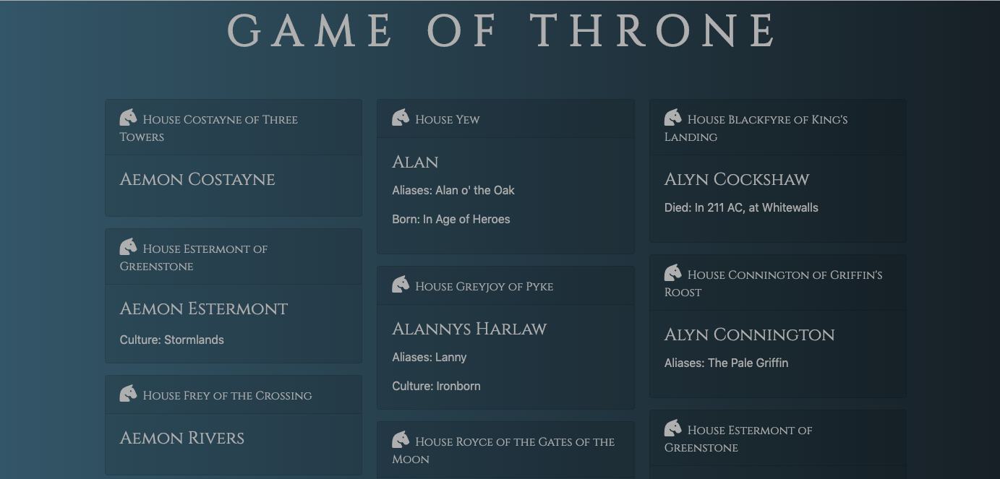

<h1> JavaScript Assignments</h1>
This repo is consisted of assignments in DigitalCrafts. 

<h3> [1] Game of Throne API</h3>

jsExercise/4_API/api_gameofthrone.1.html

I made this assignment in Week 6 of DigitalCrafts. The main purpose was to practice ajax, JSON and API to get remote data.

Requirements

API: https://anapioficeandfire.com/

- grab a list of all of the characters, and print out their name and what house they belong to

- make the name of the house clickable; when you click on it, print the house information either to the console or to the page

 

<h3> First Step </h3>
I have seen 2 episode of this show, but I am not familiar with the detail of story. As usual, I started researching on "Game of Throne" from Front End perspective -- find out theme color, fonts and though about the temperature. What I noted was "gray, dark blue, cold, castle". So I decided to use "Serif", "Silver", "Dark Blue", "Horse". 

<h3> Second Step </h3>
The API that we have used here is junior developper friendly with no API keys, no limits. I was able to understand the structure smoothly that we need API url and API keys, and then receive results using ajax. 

<h3> Images</h3>

